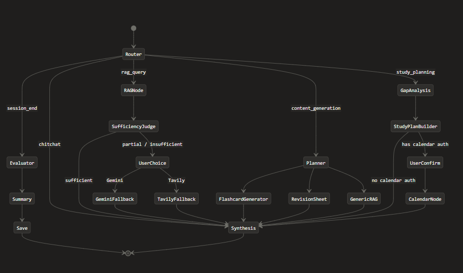

<div align="center">


# 🎓 Study Partner Agent

**An AI-powered, agentic study companion that turns your own notes into an intelligent tutor.**

Upload your documents → start a session → ask questions, generate flashcards, plan your exam schedule, and export revision sheets — all powered by RAG and a multi-node LangGraph pipeline.

[🚀 **Live Demo**](https://study-partner-agent.vercel.app/login) &nbsp;·&nbsp; [📖 API Docs](#api) &nbsp;·&nbsp; [🏗 Architecture](#architecture)

</div>

---

## ✨ Features

### 📄 Document Management
- Upload **PDF, DOCX, MD, and TXT** files (up to 20MB each)
- Files are stored on **Cloudinary** — no local disk dependency, production-safe on any free-tier host
- Documents are scoped per subject and per user — full multi-tenancy

### 🧠 Intelligent Study Sessions
- Start a session by selecting **one or more documents** from your library
- Documents are **parsed → chunked → embedded → stored in ChromaDB** on session start
- ChromaDB collections are **ephemeral** — created on start, deleted on end — keeping storage clean
- Query across all loaded documents in natural language

### 🔍 RAG + Sufficiency Judge Pipeline
The core of the system is a multi-stage retrieval pipeline that goes beyond simple vector search:

1. **RAG Node** — retrieves the top-k most relevant chunks using cosine similarity
2. **Sufficiency Judge** — a dedicated Gemini instance evaluates the retrieved context and returns one of three verdicts:
   - `SUFFICIENT` → answers immediately from your notes
   - `PARTIAL` → pauses and asks you whether to supplement with web search (Tavily) or Gemini's general knowledge
   - `INSUFFICIENT` → same interrupt, letting you choose your fallback
3. **Human-in-the-loop interrupt** — powered by LangGraph's checkpoint + interrupt system; the agent literally pauses its graph execution and waits for your decision before proceeding

### 🤖 Multi-Intent Routing
The agent classifies every message into one of six intents and routes through different graph branches accordingly:

| Intent | What happens |
|---|---|
| `rag_query` | Retrieval → Judge → (Fallback?) → Synthesis |
| `content_generation` | Planner → Flashcard generator / Revision sheet / RAG |
| `study_planning` | Gap analysis → Study plan builder → Calendar (optional) |
| `calendar_scheduling` | Direct calendar event builder → Google Calendar |
| `session_end` | Evaluator → Summary → Save & cleanup |
| `chitchat` | Direct synthesis |

### 🗂 Flashcard Generation
- Ask the agent to create flashcards on any topic during a session
- Cards are generated by Gemini using your notes as context (RAG-grounded)
- Each card is persisted to MongoDB for easy access
- Dedicated review interface to test your knowledge

### 📅 Google Calendar Integration
- OAuth 2.0 integration — connect your Google account from the app
- Agent can propose a **full study schedule** based on gap analysis: missing topics get 3 sessions, shallow topics get 2, well-covered topics get 1
- Before creating calendar events, the agent **interrupts and shows you the proposed plan** for confirmation (human-in-the-loop)
- Events are created directly in your primary Google Calendar

### 📊 Session Evaluation & Summary
When you end a session, a pipeline runs automatically:
- **Evaluator node** scores the session: topics covered, depth of discussion, weak moments, and an overall session score
- **Summary node** generates a concise, human-readable session summary
- Both are persisted to MongoDB and visible in the session history

### 📤 PDF Revision Sheet Export
- Export a beautiful, formatted **PDF revision sheet** for any subject
- The sheet is generated by the agent (RAG + Gemini) covering all session topics at exam-revision depth
- Rendered with **ReportLab** — includes topic coverage indicators (✅ well covered, ⚠️ needs work, ❌ missing)
- Downloadable directly from the UI

### 🌐 Multi-language Support
- The agent detects the language of queries and **translates them to English before embedding search** (since the embedding model is English-optimized)
- Translation via the Hugging Face Inference API (NLLB-200)
- Responses are generated in the **same language as the user's notes**

---

## 🏗 Architecture



```
┌─────────────────────────────────────────────────────────────────┐
│                         Next.js Frontend                        │
│              (App Router · TypeScript · Tailwind CSS)           │
└─────────────────────┬───────────────────────────────────────────┘
                      │ REST API
┌─────────────────────▼───────────────────────────────────────────┐
│                      FastAPI Backend                            │
│                                                                 │
│   /auth  /subjects  /documents  /sessions  /chat  /flashcards  │
│   /export  /google-oauth                                        │
│                                                                 │
│   ┌─────────────────────────────────────────────────────────┐  │
│   │                  LangGraph Agent                        │  │
│   │                                                         │  │
│   │  router → rag → sufficiency_judge → [interrupt]        │  │
│   │       ↘ planner → flashcard_generator                  │  │
│   │       ↘ gap_analysis → study_plan_builder → calendar   │  │
│   │       ↘ evaluator → summary_node → save_node          │  │
│   └─────────────────────────────────────────────────────────┘  │
└───────┬─────────────────────────────────────────────────────────┘
        │
   ┌────┴──────────────────────────────────────┐
   │                                           │
   ▼                                           ▼
MongoDB Atlas                           ChromaDB (local)
(users, subjects,                       Ephemeral session
 documents, sessions,                   vector collections
 flashcards)                            (created & deleted
                                         per session)
```

### Key Design Choices

**1. Ephemeral vector stores per session**
Rather than maintaining a single persistent vector index per user, each study session gets its own short-lived ChromaDB collection. This means documents are embedded fresh per session — isolation is perfect, there are no cross-session contamination bugs, and cleanup is trivially simple (delete the collection when the session ends).

**2. Sufficiency Judge as a circuit breaker**
A raw vector similarity score is a poor signal for answer quality. A score of 0.72 might mean the notes are perfect, or it might mean the best chunk you have is only tangentially related. The Sufficiency Judge pattern uses a second LLM call to *read* both the question and the retrieved context and make a semantic judgment — exactly what a human would do. This drastically reduces hallucinations from answering confidently with bad context.

**3. Dual Gemini key separation**
Two separate Gemini API keys are used: one dedicated to the Sufficiency Judge (a fast, deterministic classification task at temperature=0) and one for all answer synthesis. This prevents a burst of synthesis calls from hitting the judge's rate limit and vice versa.

**4. LangGraph interrupts for human-in-the-loop**
Two points in the graph pause execution and wait for user input:
- After the judge returns `PARTIAL`/`INSUFFICIENT` — let the user pick fallback strategy
- Before creating Google Calendar events — show the proposed plan and wait for confirmation

This is implemented with LangGraph's `interrupt_before` + `MemorySaver` checkpointer. The graph state is frozen in memory, the API returns to the client, and when the user responds, the graph resumes from the exact checkpoint.

**5. Document storage on Cloudinary as raw assets**
Documents are uploaded with `resource_type="raw"` so Cloudinary treats them as file storage (not image CDN). This bypasses Cloudinary's PDF delivery restrictions that apply to image-type assets. The backend downloads files at session start using an archive API call for authenticated access.

**6. Gemini API embeddings (no local model)**
Embeddings use Google's `gemini-embedding-001` via API rather than a local `sentence-transformers` model. This eliminates a ~500MB model download on deployment, making the backend compatible with free-tier cloud hosts that have strict RAM and disk limits.

---

## 🛠 Tech Stack

### Backend
| Layer | Technology |
|---|---|
| API Framework | FastAPI + Uvicorn |
| Agent Orchestration | LangGraph (StateGraph with interrupts) |
| LLM | Google Gemini 2.5 Flash |
| Embeddings | Google Gemini Embedding API (`gemini-embedding-001`) |
| Vector Store | ChromaDB (ephemeral, per-session) |
| Database | MongoDB Atlas (Motor async driver) |
| Document Storage | Cloudinary |
| Web Search Fallback | Tavily Search API |
| PDF Parsing | PyMuPDF (fitz) + pypdf |
| PDF Export | ReportLab |
| Auth | JWT (python-jose) + bcrypt |
| Google OAuth | google-auth + google-api-python-client |

### Frontend
| Layer | Technology |
|---|---|
| Framework | Next.js 14 (App Router) |
| Language | TypeScript |
| Styling | Tailwind CSS |
| HTTP Client | Axios / fetch |

---

## 🔐 Authentication

- **Email/password** registration and login with bcrypt hashing and JWT tokens
- **Google OAuth 2.0** — sign in with Google; OAuth tokens are stored encrypted in MongoDB and used for Google Calendar API calls
- All API routes are protected with JWT bearer token authentication
- Rate limiting via SlowAPI on sensitive endpoints

---

## 📁 Project Structure

```
study-agent/
├── agent/
│   ├── graph.py            # LangGraph topology definition
│   ├── nodes.py            # All node implementations
│   ├── state.py            # AgentState TypedDict
│   ├── sufficiency_judge.py # RAG quality evaluator
│   ├── tavily_search.py    # Web search fallback
│   └── tools.py            # search_notes, flashcards, study_plan, etc.
├── routes/
│   ├── auth.py             # Register, login
│   ├── chat.py             # Chat endpoint (drives the LangGraph agent)
│   ├── documents.py        # Upload, list, delete documents
│   ├── sessions.py         # Start, end, list sessions
│   ├── flashcards.py       # List flashcards, SM-2 review
│   ├── export.py           # PDF revision sheet export
│   └── google_oauth.py     # Google OAuth flow
├── db/
│   └── chroma.py           # ChromaDB session collection manager
├── utils/
│   ├── embedder.py         # Gemini embedding API wrapper
│   ├── file_parser.py      # PDF/DOCX/MD/TXT → LangChain Documents
│   └── chunker.py          # Document chunking strategies
├── frontend/               # Next.js application
├── server.py               # FastAPI app + lifespan startup
├── models.py               # Pydantic request/response models
└── cleanup.py              # Orphaned session cleanup job
```

---

## 🤝 Contributing

Pull requests are welcome. For major changes, please open an issue first to discuss what you'd like to change.

---
